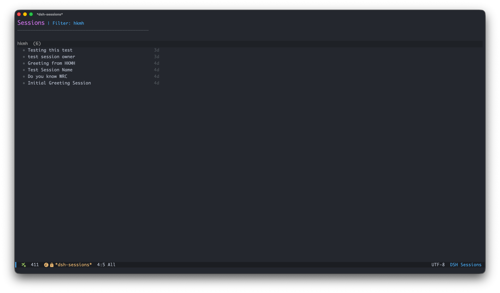
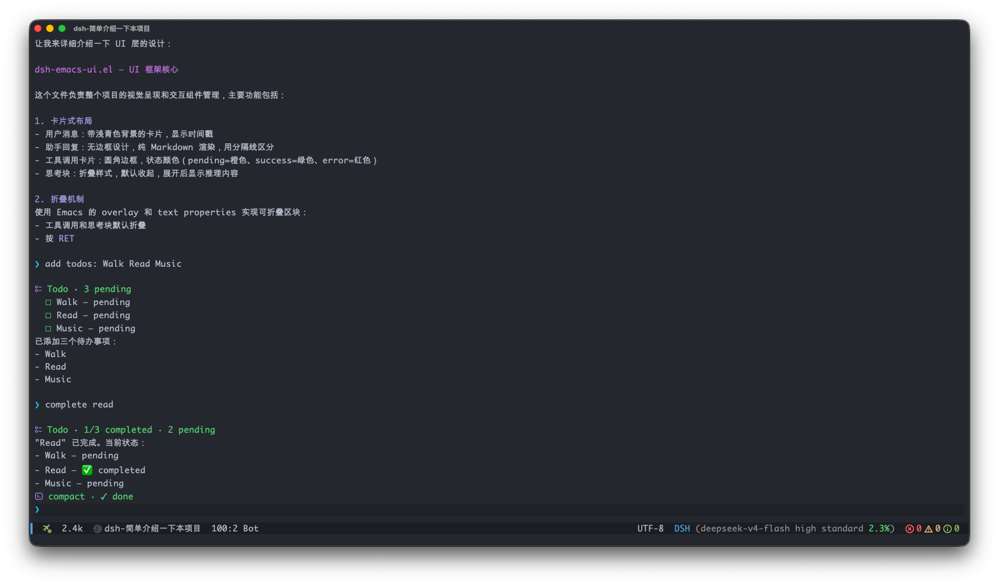

# dsh-emacs — An Emacs client for DeepSeek Harness

**dsh-emacs** is an Emacs frontend for [DeepSeek Harness](https://github.com/deepseek-ai/deepseek-harness) (`dsh`): it talks to a running dsh web service over plain HTTP/WebSocket and renders sessions, streaming replies, tool calls, thinking blocks and slash commands with an Emacs-native UI.

It aims to be the complete, zero-friction client for dsh web — built on
nothing but Emacs built-ins (Emacs 27.1+), with zero third-party dependencies.

## Quick Start

**Requirements:** Emacs 27.1+. The dsh CLI is optional — if it is missing, the
first server-touching command offers to install it, then starts the server for
you. No build step, no manual `dsh web`.

Install from this repository:

```emacs-lisp
(add-to-list 'load-path "/path/to/dsh-emacs")
(require 'dsh-emacs)
```

Then `M-x dsh-emacs` to open the session list. That's it.

## A fuller example

This shows a typical setup — server auto-start, defaults, custom keybindings —
and how a session lands in the right workspace:

```emacs-lisp
(use-package dsh-emacs
  :load-path "/path/to/dsh-emacs"
  :commands (dsh-emacs dsh-emacs-new-session)
  :custom
  (dsh-emacs-base-url "http://127.0.0.1:3080")   ; point at a remote server instead
  (dsh-emacs-default-model "deepseek-v4-flash")
  (dsh-emacs-default-preset "code")
  (dsh-emacs-server-start-on-init t)             ; eager background start
  :bind (("C-x d" . dsh-emacs)                   ; open the session list
         :map dsh-emacs-mode-map                 ; inside a chat buffer
         ("C-c C-a" . dsh-emacs-attach-file)))
```

Common keys inside a chat: `C-c C-c` send — press again to interrupt —
`C-c C-m` switch model, `C-c C-a` attach an image, `C-c C-r` refresh,
`C-c C-s` switch session in this workspace (`C-c M-s` or `C-u C-c C-s`
across all workspaces),
`C-c C-f` toggle the mode-line stats, `TAB` complete `/name`. In the session list:
`RET` open, `c` create, `w` workspace filter, `/` search, `g` refresh.
Everything else is in the [manual](#documentation).

## Server setup

By default everything is managed for you: before the first RPC,
`dsh-emacs-server-ensure` probes the base URL, locates (or offers to install)
the `dsh` CLI, and spawns `dsh web --no-open` in the background. Set
`dsh-emacs-server-auto-start` to nil to run the server yourself — a server you
start is used and never killed.

Works with remote deployments too: a non-loopback base URL — including
`https://` and nginx Basic-Auth via `user:pass@host` — is probed and used
directly, and dsh-emacs never spawns a local server for a remote one.

Provider/model configuration is **owned by dsh**, not by dsh-emacs: configure
it in the dsh web UI (`M-x dsh-emacs-open-web`) or the dsh home files
(`~/.dsh/settings.yaml`, `~/.dsh/.credentials.yaml`).

## Screenshots





## Documentation

- [Architecture](docs/architecture.md) — module layout, RPC API, event flow
- [RPC protocol](docs/rpc.md) — complete dsh wire reference: methods, events, projections
- [Slash commands](docs/slash-commands.md) — semantics, catalog, completion
- [Model picker](docs/model-picker.md) — grouping, icons, reasoning effort
- [Mode line](docs/modeline.md) — segments, context% source, spinner
- [UI styling](docs/ui-styling.md) — faces, dsh-web icons, markdown rendering
- [Customization](docs/customization.md) — every option
- [Development & testing](AGENTS.md) — workflow and verification commands
- [Changelog](CHANGELOG.md)

## Contributing

Changes come in via pull request; the `main` branch is protected, and each PR
should be one topic. For non-trivial work, open an issue first to align the
scope. Development workflow, verification commands and commit conventions are
in [AGENTS.md](AGENTS.md) — run
`emacs -Q --batch -l scripts/check-lisp.el` and the test suite before pushing.

## Acknowledgments

The UI is designed to mirror the
[dsh web](https://github.com/deepseek-ai/deepseek-harness) UI: tool rows reuse
its exact SVG icons and `ToolRow` / `ioCard` semantics, and the session list,
command rows and context meter follow dsh-web conventions.

The Markdown-rendering and folding machinery builds on
[agent-shell](https://github.com/xenodium/agent-shell) (`agent-shell-ui.el` /
`agent-shell-markdown`), and the mode-line stats and compact token formatting follow
[pi-mono](https://github.com/badlogic/pi-mono).

## License

[GPL-3.0-or-later](LICENSE) — GNU General Public License v3 or later.